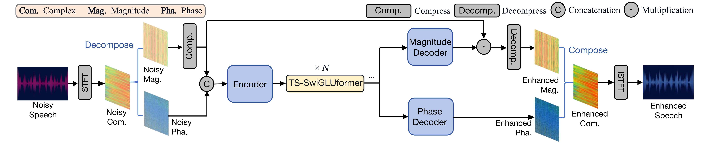
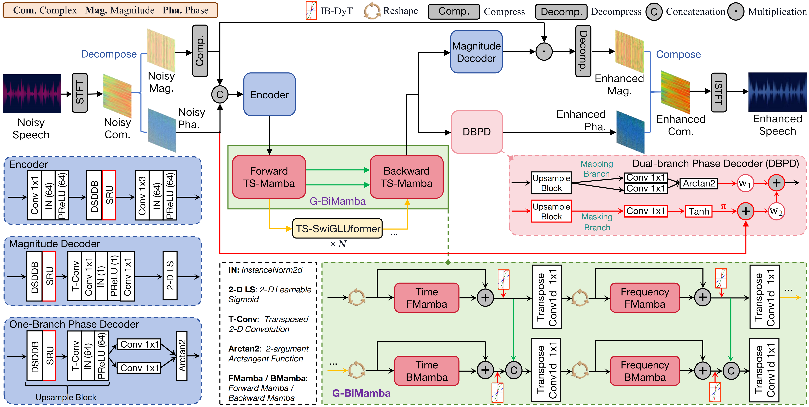
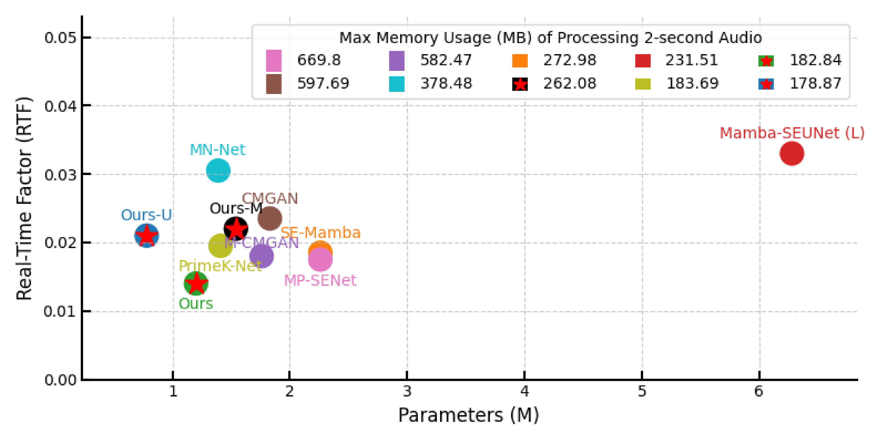

# DyTSwiG-Mamba: Layer Normalization-free CNN-Mamba Speech Enhancement Network via Dual-branch Phase Prediction (Under TASLP Review)
### Yujie Xiong and Zhihua Huang
Audio samples are from VoiceBank+DEMAND dataset and THCHS+DNS dataset (mixed with THCHS-30 dataset and DNS-Challenge dataset). The source code is located in the directory "DyTSwiG-SE-Main". The wav files are resampled to 16kHz in our experiments.

**Abstract:** 
Speech enhancement (SE) models with deep denoising networks (DDNs) often consist of many stacked Two-Stage (TS) blocks to gradually improve the input signal, structuring the denoising task as progressive learning. These methods demonstrate impressive performance, while also facing efficiency challenges from the TS block.  Meanwhile, they also leave two potential problems: 1) Hierarchical representation of identical features across different depths in unidirectional TS blocks can lead to information loss through successive propagation; 2) Typical phase prediction strategy ignores the conditional information of noisy phase. This paper presents an efficient monaural SE network and a CNN-Mamba hybrid network, namely DyTSwiG-Net and DyTSwiG-Mamba. Specially, we propose an Input-Biased Dynamic Tanh (IB-DyT) for layer normalization-free models. Furthermore, we propose a SwiGLUformer to more efficiently play the role of TS block.
In response to the two problems, we propose a Global Bidirectional Mamba (G-BiMamba) for enhanced information aggregation around TS blocks, and a Dual-Branch Phase Decoder (DBPD) to jointly predict phase mapping and phase mask in parallel. 
Both models are thoroughly evaluated on three datasets from two languages, English and Mandarin. Experimental results show that DyTSwiG-Net outperforms current competitive models in inference speed while maintaining outstanding performance, and DyTSwiG-Mamba outperforms the latest state-of-the-art method while cutting efficiency costs by one-quarter. Through spectrogram visualization, the effectiveness of DBPD and the denoising performance of DyTSwiG-Mamba are visually verified. When used as a front-end system for two downstream ASR models, our methods achieve a lower character error rate (CER) on Mandarin speech.

## Pre-requisites
1. Python >= 3.9.
2. Clone this repository.
3. Install python requirements. Please refer [packages_for_environment.txt](https://github.com/Yj-Xiong/DyTSwiG-SE/blob/main/DyTSwiG-SE-Main/packages_for_environment.txt).
4. Download and extract the [VoiceBank+DEMAND dataset](https://datashare.ed.ac.uk/handle/10283/1942). 
5. Move the clean and noisy wavs to `VoiceBank+DEMAND/wavs_clean` and `VoiceBank+DEMAND/wavs_noisy` or any path you want, and change the path in train.py [parser.add_argument('--input_clean_wavs_dir', default=], respectively. Notably, different downsampling ways could lead to different result. 

## Training
For a single GPU in recommended environment settings, DyTSwiG-Net needs at least 14GB GPU memery, whereas DyTSwiG-Mamba needs at least 16GB GPU memery. Edit imports of models (generators) in train.py and run
```bash
cd DyTSwiG-SE-Main
CUDA_VISIBLE_DEVICES={GPU_ids} python train.py \
    --config "config.json" 
```

## Training with Other Dataset
Ensure the new clean and noisy files are moved to `OtherDataset/wavs_clean` and `OtherDataset/wavs_noisy`.
Edit path in make_file_list.py and run
``` bash
cd DyTSwiG-SE-Main/tools
python make_file_list.py
```
Then replace the test.txt and training.txt with generated files in folder "./OtherDataset" and put your train and test set in the same folder(clean or noisy).

## Inference
```bash
cd DyTSwiG-SE-Main
python inference_and_cal_metric.py --checkpoint_file=/home/xyj/DyTSwiG-SE-Main/ckpt/g_best
```

You can also use the pretrained best checkpoint file we provide in `ckpt/g_best`.<br>
Generated wav files are saved in `generated_files` by default.<br>
You can change the path by adding `--output_dir` option.

## Model Architecture
The architecture of proposed DyTSwiG-Net

The architecture of proposed DyTSwiG-Mamba


## Efficiency Comparison
The efficiency comparison with other state-of-the-art metheds. Our proposed models are with a pentagram mark.


## Visualization
For DBPD module, the spectral visualization uses p232_020.wav and p232_020.wav from VB+DEMAND dataset, respectively.


For Mandarin enhancement results with different denoising models, the spectral visualization uses D21_866.wav from THCHS-30 dataset.


## Acknowledgements
We referred to [PrimeK-Net](https://github.com/huaidanquede/PrimeK-Net/).
